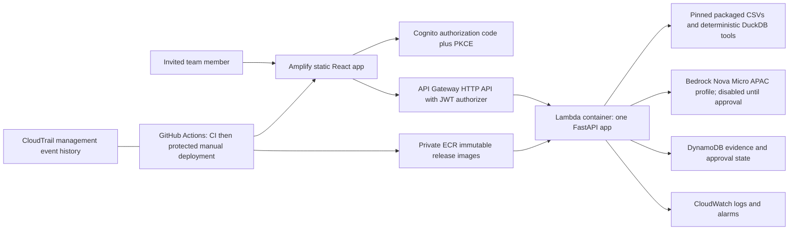

# BizzyBee POC deployment and approval plan

Updated 2026-09-27, Asia/Singapore. This document supersedes the discovery assumptions in README.md. The approved seven-resource S3/ECR bootstrap is provisioned and verified. No runtime deployment, invitations, paid inference, remote GitHub settings, commits or pushes have been performed. See [NEXT_APPROVAL.md](NEXT_APPROVAL.md) for the next bounded approval package.

## Accepted scope

Delivery policy: GitHub Actions deployment jobs are explicitly disabled (`if: false`) in both application workflows. CI remains enabled for pull requests/main; manual AWS releases require owner approval. Re-enabling CD requires a separately approved protection/trust design, not merely setting repository variables.

Current execution status: [RUNTIME_STATUS.md](RUNTIME_STATUS.md). The approved 26-resource runtime was applied and health/auth-denial/CORS checks passed. Frontend publication, invitations and paid inference remain gated.

Latest runtime review: [RUNTIME_REVIEW.md](RUNTIME_REVIEW.md). The current review plan defaults GitHub deployment roles off because the private repositories on GitHub Free lack the required approval gate. Owner-operated deployments are proposed pending approval; automated CD is deferred, not declared complete.

- Account 524097108092, ap-southeast-1, invited hackathon users only.
- Final user decision: **USD 50 every month**, including September and subsequent months, account-wide. This supersedes the interim SGD requirement. The account is standalone, not an Organization; unrelated workloads share the allowance. The existing live USD 50 monthly budget already matches the amount and has not been changed.
- One FastAPI application with eight logical roles; React frontend; unchanged synthetic source dataset/reporting cutoff 2026-09-23.
- Cognito login; only the owner belongs to the approvers group. Three teammates can analyze and inspect their own workflow records. Owner can inspect all workflows. All invited users share this single synthetic business dataset; this is not multi-tenant isolation.
- Bedrock regional geography may extend beyond Singapore if cheaper. The initial proposal remains Nova Micro through an explicit APAC inference profile; no provider/model/geography fallback.
- CloudTrail is for AWS control-plane activity; application evidence and decisions require DynamoDB. No payments, communications or purchasing execution is implemented. Approval records permission to proceed with a draft only; it does not execute it.

## Architecture



Lambda avoids always-running compute, NAT gateways and load balancers for a four-user POC. App Runner is not assumed available for new customers. Trade-offs: cold starts, synchronous HTTP deadline, low concurrency, and SQL over CSV rather than a persistent database. Real Lambda memory/latency and authenticated Cognito integration remain deployment acceptance gates; local emulation is not an AWS performance measurement. Frontend assets are public static code, but all business APIs require authentication.

## Resource inventory and ownership

| Root | Resources | Ownership |
| --- | --- | --- |
| infra/bootstrap | Private state bucket with encryption/versioning/TLS-only policy; immutable private ECR with scan-on-push | One-time infrastructure operator |
| infra/runtime | Amplify app/branch without Git connection; invite-only Cognito pool, public client, domain, approvers group | Terraform |
| infra/runtime | Lambda container, live alias, API Gateway JWT routes/CORS/throttling; DynamoDB on-demand table with PITR/delete protection | Terraform configuration; Actions owns image releases and live alias version |
| infra/runtime | Three IAM roles: runtime, backend deployment, frontend deployment; policies against existing GitHub OIDC provider | Terraform |
| infra/runtime | 14-day Lambda/API logs, error/duration/fallback alarms | Terraform; console alarms only, no SNS notification channel initially |
| infra/budget | Import/update existing My Monthly Cost Budget; no new duplicate | Infrastructure operator after separate budget approval |

No RDS, Cognito identity pool, Secrets Manager secret, vector database, managed Bedrock Agent, provisioned concurrency, new CloudTrail Lake store, domain purchase or Route 53 zone. CloudTrail management event history is the initial AWS audit boundary; it is not a new durable S3 trail and does not cover all data-plane events. Export/long-term CloudTrail retention requires a separate reviewed trail configuration. Application audit records have no automatic TTL initially; review/delete/export at POC teardown rather than silently expiring approvals. This is not a WORM archive.

Tagged ECR releases are retained for rollback; only untagged images expire after 14 days. This intentionally avoids deleting an older image still referenced by Lambda. Review tagged storage after each release; clean only after verifying live and rollback references. DynamoDB record size is explicitly bounded at 350 KB; oversized workflows fail closed, not silently truncate evidence.

## IAM model

- Local operator: prefer SSO. The verified current identity is an IAM user; no new access keys or broad administrator roles are created by this work. Bootstrap/apply must use a separately approved infrastructure identity.
- Runtime: Lambda trust only; GetItem/PutItem/UpdateItem on the single audit table; write only its log streams; optional InvokeModel on exact approved profile/model ARNs. No streaming, Marketplace activation, Cognito admin, payment, IAM, S3 state or deletion permissions.
- Backend deployment: exact repository/environment OIDC subject `repo:BizzyBeeAI/BizzyBackend:environment:poc`, audience sts.amazonaws.com. Push images to one ECR repository; update/publish Lambda code, test a qualified version, update live alias. No role passing, runtime configuration edits, IAM or Terraform apply permissions.
- Frontend deployment: corresponding BizzyFrontend environment subject; CreateDeployment/StartDeployment/GetJob on one Amplify branch and its jobs only.
- Both deployment roles require GitHub environment rules limiting deployment to main. An environment-based OIDC subject does not independently constrain the ref: environment protection is a required bootstrap gate, not an optional enhancement.
- GitHub currently has only unprotected copilot environments. The poc environment must be created with main-only deployment and required owner review where the organization's GitHub plan permits it. If private-repo required-reviewer protection is unavailable, stop; agree an alternative approval gate before enabling deployment roles.
- Terraform state is private, encrypted, versioned, with native S3 locking. Routine deployment roles cannot access it. Grant only the approved infrastructure identity state-key and lock-key access; never upload state or plans as public artifacts.

## Bedrock choice and live discovery

Read-only SDK discovery on 2026-09-27 verified Nova Micro as ACTIVE; agreement/entitlement AVAILABLE and authorization AUTHORIZED. Singapore supports this model via INFERENCE_PROFILE, not direct on-demand model ID. No inference was performed.

Profile: `apac.amazon.nova-micro-v1:0`.

Current destination model ARNs identify Singapore, Sydney, Tokyo, Seoul, Osaka and Mumbai. The exact ARNs are in infra/runtime/terraform.tfvars.example. Re-read profile membership before approving IAM and inference; AWS may evolve routing. Do not widen IAM automatically when destinations change.

Public Singapore price-list data effective 2026-09-01 reports Nova Micro standard input USD 0.000047 per 1K tokens and output USD 0.000188 per 1K tokens. Therefore 1,000 classifier calls at 500 input and 128 output tokens cost approximately USD 0.0476. This is a modeled example, not measured token usage; long questions cost more. Deterministic known intents skip inference. Batch pricing is cheaper but inappropriate for synchronous questions. No claim is made that this is globally the cheapest model that would pass five-language quality tests.

The adapter uses boto3 Converse, role credentials, 128 output tokens, a 2-second connect timeout and 6-second read timeout, with one total attempt (no retry amplification). Timeout is an SDK transport bound, not a guaranteed application deadline; API Gateway/Lambda enforce the final deadline. All returned names must be unique allowed specialist names. Malformed/truncated/denied/throttled output produces a visible partial/clarification response with deterministic dashboards remaining available. No raw prompt logging. Metrics record model, latency, tokens and fallback. Advisor explanations remain deterministic; this patch does not claim new Tamil/Malay/Hindi generation support.

Paid smoke command after specific approval only:

```sh
PYTHONPATH=. BIZZY_MODEL_PROVIDER=bedrock BEDROCK_MODEL_ID=apac.amazon.nova-micro-v1:0 python scripts/bedrock_smoke.py --approved-paid-inference
```

## Cost envelope

Planning assumptions: four users, 10,000 API requests/month averaging 1 GB-second each, 1,000 of these needing model routing, <=1 GB frontend transfer, <1 GB logs and audit data, and a small number of retained container releases. No free credits are assumed to eliminate spend.

| Component | Monthly planning allowance, USD |
| --- | ---: |
| Lambda and HTTP API under stated request assumptions | <1 |
| Bedrock under stated token assumptions | 0.05 |
| Amplify static storage/transfer, no Amplify builds | 1 |
| ECR images, state storage, DynamoDB requests/storage/PITR | 3 |
| CloudWatch logs and three alarms | 2 |
| Cognito four MAU | Verify account/tier free allowance; reserve 1 |
| Contingency including taxes/usage variation | 5 |

Reserve roughly USD 13/month incrementally for this small demo; this is an engineering allowance, not an AWS Calculator quote or guarantee. All unit rates other than the model example must be refreshed in the reviewed deployment estimate. The USD 1.10 budget snapshot leaves USD 48.90 against the recurring USD 50 allowance, not guaranteed current headroom: billing is delayed and unrelated workloads share it. GitHub private-repository Actions minutes and artifacts are separately billed by GitHub and are NOT controlled by the AWS budget. Large image artifacts are retained seven days, release metadata/frontend artifacts ninety days; check GitHub quota before enabling CI.

## Exact budget proposal

Import the existing MONTHLY COST budget, preserving its USD 50 limit and start 2026-05-01 UTC/end 2087-06-15 UTC. Terraform monthly_limit_usd defaults to the final confirmed amount of 50. Scope: entire account, every service/Region; no tag, linked-account, project, service or Region filter. Exclude Credit and Refund record types; include usage, subscriptions, upfront/recurring fees, tax, support and applicable discounts; unblended, non-amortized. This agrees with the existing live FilterExpression (NOT Credit/Refund) and Metrics (UnblendedCost); inspect the plan for semantic equivalence when the provider represents these using CostTypes. Notification updates/import remain separately gated; no remote budget mutation has been performed.

Notify the owner's approved email directly, no SNS: actual >50%, >80%, >100% (USD 25/40/50); forecast >100% (USD 50). GREATER_THAN triggers on crossing, not equality. Existing actual >85%, >100% and forecast >100% would be replaced, not duplicated, only after separate approval. No budget actions, shutdowns or SCPs.

Latest read-only budget snapshot: actual USD 1.10, forecast USD 1.299, updated 2026-09-26 19:59:39 Singapore. Cost Explorer unblended MTD through September 25 inclusive (end September 26 exclusive) reported usage USD 1.0038081791 plus tax USD 0.09, estimated. Different refresh times/rounding explain why these are not exact matches. No requested threshold was exceeded in these snapshots. Refresh before applying. Alerts are delayed and are not hard caps.

## Configuration matrix

| Where | Setting | Value/source |
| --- | --- | --- |
| Backend runtime | APP_ENV | poc; never development on deployed service |
| Backend runtime | COGNITO_ISSUER / COGNITO_CLIENT_ID | Terraform pool/client outputs |
| Backend runtime | BIZZY_AUDIT_TABLE | Terraform DynamoDB table |
| Backend runtime | CORS_ORIGINS | Exact Amplify HTTPS origin |
| Backend runtime | BIZZY_MODEL_PROVIDER | disabled until separately approved; then bedrock |
| Backend runtime | BEDROCK_MODEL_ID/MAX_TOKENS/READ_TIMEOUT | Explicit APAC profile / 128 / 6 |
| Backend runtime | BIZZY_RECORD_QUESTIONS | false; evidence/actions are stored, raw question omitted |
| Packaged image | BIZZY_DATA_DIR / BIZZY_AS_OF_DATE | /var/task/data/demo / 2026-09-23 |
| Frontend build, repository variables | VITE_API_BASE_URL | API output plus /api/v1 |
| Frontend build, repository variables | VITE_COGNITO_ISSUER/CLIENT_ID/DOMAIN | Terraform outputs; public identifiers only |
| Frontend build, repository variables | BACKEND_COMMIT / DATASET_COMMIT / BEDROCK_MODEL_ID | Explicit paired release refs/model configuration |
| Backend deployment, poc environment | AWS_DEPLOY_ROLE_ARN / API_ORIGIN / FRONTEND_COMMIT | Backend role, API origin without trailing slash, paired 40-character frontend ref |
| Frontend deployment, poc environment | AWS_DEPLOY_ROLE_ARN / AMPLIFY_APP_ID | Frontend role and application ID |
| Budget apply, local ignored tfvars | notification_email | Approved owner recipient; do not put real user emails into example files |

Frontend build variables are repository variables because the unprivileged build job intentionally has no deployment environment. No credentials go into VITE variables. No OpenAI/Anthropic API key is requested or used. No Secrets Manager resource is needed for this configuration.

## Bootstrap runbook — requires approval

1. Review local diffs, security changes and paired frontend PR work. Create approved feature branches/PRs; do not commit directly to main. Do not touch existing stashes or other worktrees.
2. Verify STS account and the chosen infrastructure session. Inspect/import any colliding names, existing OIDC provider, budget and state before creation. Never reuse unrelated MintCommerce resources.
3. Review bootstrap plan for S3/ECR; approve/apply it separately. Initial bootstrap state is local and sensitive: keep an encrypted backup and then migrate it to its own key in the new bucket by adding an S3 backend and using init -migrate-state after approval. Runtime/budget roots use different keys. Do not discard local state before verifying migration.
4. Build/test/scan the Lambda image once; push that exact image into ECR using the approved bootstrap identity. Record its digest. The runtime cannot be created before a tested image exists. No CI deployment-role bootstrap chicken-and-egg workaround with broad trust.
5. Initialize runtime with backend.hcl.example copied to ignored backend.hcl. Copy reviewed terraform.tfvars.example to ignored terraform.tfvars, insert the tested digest and leave inference disabled. Run plan into a private ignored .tfplan; inspect every resource/IAM policy. Apply only the approved plan.
6. Prepare poc GitHub environments, reviewer/main-only rules, required CI branch checks and nonsecret variables. Review exact remote settings before enabling them. Amplify Git integration stays disconnected: Actions is the single deployment controller.
7. Invite the approved owner and three teammates only after invitation approval. `scripts/invite_user.py` requires pool/email and an explicit execution flag; add --approver ONLY for the owner. It avoids re-inviting existing users and never prints passwords. The script performs Cognito admin calls and sends emails: do not run it as a read-only check.
8. Import the existing budget only after approval, using resource address aws_budgets_budget.account and provider import ID `524097108092:My Monthly Cost Budget`. Review notification/cost semantics before apply; do not create a second budget.
9. Deploy frontend, log in, verify allowed/denied paths, workflow evidence and owner-only approvals. If separately approved, enable the exact Bedrock targets and run one paid smoke. Keep paid tests outside ordinary CI.

## Routine deployment and rollback

Both workflows always run unprivileged validation on PRs/main. Deployment runs ONLY on workflow_dispatch at main after validation and environment approval; pushes do not automatically deploy. Third-party actions are pinned to verified immutable SHAs. Each service serializes deployment jobs; images/zips built in validation are reused, not rebuilt in the privileged job. Never use pull_request_target to run submitted code.

Backend: publish immutable SHA/run/attempt-tagged image, resolve digest, capture previous live alias, update unpublished function code, publish a numbered version, invoke candidate readiness, atomically move live using alias RevisionId, then check HTTPS readiness. Failure after alias movement attempts conditional rollback to the previous version; a concurrent manual alias change prevents blind overwrite. release.json records backend/frontend refs, dataset manifest, model and old/new versions. Runtime configuration changes are a separate Terraform operation; because live aliases point to versions, explicitly publish/test/promote after configuration updates too.

Rollback backend: after explicit approval, verify recorded prior version/digest still exists; get current live RevisionId and update only the alias to the recorded version with that revision condition. Retain previous images/versions until rollback is proven. No schema migration is introduced, but future schema changes must remain backward compatible.

Frontend: deploy the validated zip via Amplify manual deployment, bounded status polling. Rollback by redeploying a retained prior frontend.zip with its matching release metadata and API/Cognito settings; do not rebuild an old commit against today's configuration. Check the returned URL and release.json before declaring success. If a job times out, inspect it before retrying to avoid overlapping deployments. Authenticated end-to-end checks are manual approval gates because CI does not hold user passwords.

## Validation and troubleshooting

- Local tests: `pytest -q`; opt-in routing benchmark remains excluded by default and must not be mistaken for passing multilingual coverage.
- Data: existing validator; package script pins and checks clean dataset source; verify_data.py checks archive and every member hash. Source CSVs are unchanged. A tenth file, scenario_expectations.csv, is now bundled for standalone CI regression; macOS archive metadata removed.
- Container: Dockerfile.lambda with pinned Python base digest; scripts/smoke_container.py verifies readiness and deterministic specialists without a sibling checkout or paid inference. CI scans HIGH/CRITICAL vulnerabilities and fails closed.
- Frontend: npm ci, lint, build, test:contract. Contract snapshot is generated from backend OpenAPI via `PYTHONPATH=. python scripts/export_contract.py --output ../BizzyFrontend/contracts/backend.openapi.json`; refresh and review it with paired contract changes. It checks routes/auth/required fields, not every runtime semantic. Existing integration-test.mjs exercises running local services and should be run before release.
- 401: check issuer/client/token_use, access-token expiry and Authorization header. No ID token accepted by backend. Sessions are memory-only; page reload requires sign-in again (Cognito session can shorten the redirect). Revocation/group removal can remain effective only after existing JWT expiry (15 minutes); use emergency API disablement if necessary.
- 403 on approval: owner must be in approvers group and re-login after assignment. Never trust a UI field to grant the role.
- 409 on approval: another decision already won; reload audit. Repeating the same actor/decision is idempotent. No rejected/approved/blocked action can be transitioned to another outcome.
- 503 audit: inspect IAM/table availability, 350 KB record cap and CloudWatch. Do not report success or execute actions without durable persistence. JSONL is development-only; no filesystem fallback in deployed mode.
- Model failure: read structured bedrock_routing outcome/latency/token/fallback logs. Verify exact profile targets and permissions; never resolve failures by switching provider/model silently. No prompt text is logged by default, but persisted evidence may contain sensitive data in a future real-data deployment.
- Alarms have no SNS actions initially: someone must monitor CloudWatch. Budget email is not an operational incident channel. Add an approved notification channel before any production claim.

## Teardown — separate destructive approval

Disable manual deployments and new invitations. Export required audit evidence and release metadata. Remove public API/frontend access, then review a targeted destruction plan for POC-only resources. Cognito/DynamoDB deletion protection and Terraform prevent_destroy deliberately require explicit edits and approval. Preserve/export audit data before removal. Retain ECR rollback images until the service is deleted. Keep the state bucket and account-wide budget by default: the budget covers unrelated workloads. Never delete the shared GitHub OIDC provider, unrelated AWS resources, stashes or source datasets. Revoke POC deployment-role trust after teardown.

## External approval checklist

- S3/ECR bootstrap, then runtime infrastructure and exact IAM policies after a reviewed plan.
- GitHub poc environments, main-only protection/reviewer settings, branch CI gates and variables.
- Cognito owner/three teammate invitations and owner group assignment.
- Existing account budget update with exact notification recipient, thresholds and cost settings.
- Tested-image/frontend artifact deployments and authenticated smoke tests.
- Separate paid Bedrock enablement/smoke against the six-region APAC profile.

## Sources checked

- https://docs.aws.amazon.com/apprunner/latest/dg/apprunner-availability-change.html
- https://docs.aws.amazon.com/lambda/latest/dg/python-image.html
- https://docs.aws.amazon.com/bedrock/latest/APIReference/API_runtime_Converse.html
- https://docs.aws.amazon.com/cognito/latest/developerguide/amazon-cognito-user-pools-using-tokens-verifying-a-jwt.html
- https://authts.github.io/oidc-client-ts/interfaces/UserManagerSettings.html
- https://developer.hashicorp.com/terraform/language/backend/s3
- https://pricing.us-east-1.amazonaws.com/offers/v1.0/aws/AmazonBedrock/current/ap-southeast-1/index.json
- https://aws.amazon.com/lambda/pricing/
- https://aws.amazon.com/amplify/pricing/
- https://aws.amazon.com/aws-cost-management/aws-budgets/pricing/
